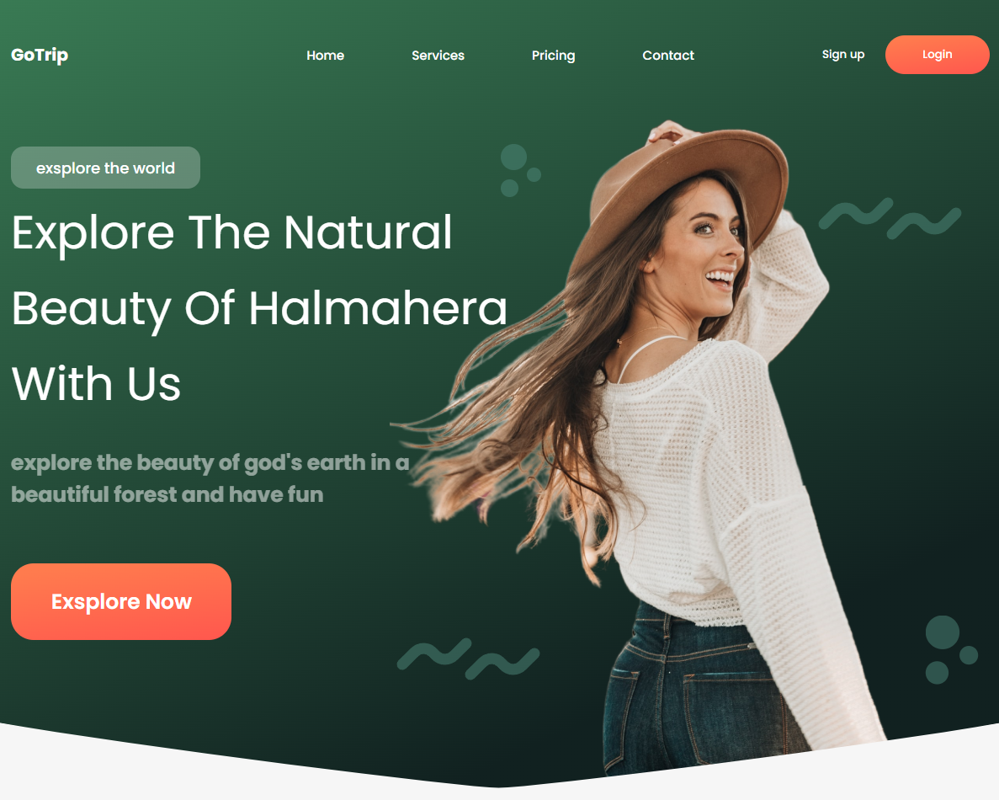

# GoTrip

Данный проект представляет собой одностраничный сайт (лендинг), написанный самостоятельно по макету **Figma**.

<p align="center">
  
  <br/>
  <em>Рисунок 1 - первый блок на странице</em>
</p>

В проекте использовались следующие технологии

1) Верстка на обычных **HTML**, **CSS**
2) Популярная библиотека **Swiper** для прокрутки карточек товара
3) Использование **JS** только для библиотеки **Swiper**

## Как можно посмотреть лендинг
Данный сайт никуда не размещен, поэтому можно посмотреть, склонировав репозиторий и открыв файл ```index.html``` в браузере.

## Информация
Некоторая информация, которую проще по пунктам расписать:
1) Сайт - учебный, одностраничный, прежде всего использовался для обучения верстке
2) Адаптирован под мобильные устройства (с помощью media-запросов), desktop-first
3) Написан в феврале 2024 года
